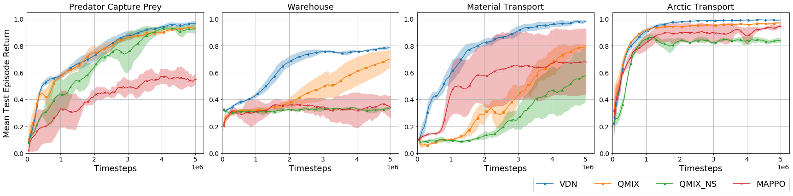

<!-- # MARBLER: An Open Platform for Standarized Evaluation of Multi-Robot Reinforcement Learning Algorithms  -->

[Reza J. Torbati](https://github.com/RezaTorbati), 
[Shubham Lohiya](https://shubhlohiya.github.io/),
[Shivika Singh](https://github.com/shivika275),
[Meher S. Nigam](https://github.com/ShashwatNigam99),
[Harish Ravichandar](https://harishravichandar.com/)

[📄 Paper](https://arxiv.org/abs/2307.03891) &nbsp;&nbsp;&nbsp; [💻 Code](https://github.com/ShashwatNigam99/MARBLER) &nbsp;&nbsp;&nbsp; [📁 Supplementary Material](assets/supplementary.pdf)

## About 

Recent years have seen rapid improvements in Multi-Robot Reinforcement Learning (MRRL). However, many of these novel algorithms have limited real world testing. Although there are several environments for evaluating MRRL algorithms, few of them offer dynamics similar to what real robots experience, and fewer can also test Sim2Real performance. To address these issues, we introduce MARBLER: **M**ulti-**A**gent **R**L **B**enchmark and **L**earning **E**nvironment for the **R**obotarium. MARBLER is a platform built using the Robotarium's simulator that allows for rapid prototyping of new MRRL experiments.

## MARBLER -- Platform Structure


MARBLER comprises several components that form the foundation of the platform:

**Core:** The Core component serves as the fundamental building block of MARBLER, leveraging the Robotarium's python simulator. It encompasses critical functionalities necessary for the environment, such as environment resetting and discrete time step advancement. 

**Scenarios:** The scenarios module defines the environments the robots interact in and the specific tasks they must accomplish. MARBLER offers a collection of pre-defined scenarios, enabling researchers to readily explore various environments. MARBLER also makes it easy for researchers to define their own environments for the Robotarium. 

**Gym Interface:** Each scenario within MARBLER is registered as a Gym environment, allowing direct compatibility with the algorithms and tools that support the OpenAI Gym interface. 

**Test Pipeline:** The Test Pipeline provides a streamlined process for importing trained robots into the simulation environment, allowing visualization of robots performance and collection of test data.

## Results

<div style="margin-bottom: 0;">
  
</div>

<div align="center">
  <small><em>Evaluation returns for each algorithm during training. The solid line is the mean reward across the five seeds and the shaded area is the 95% confidence interval.</em></small>
</div>
<br>

We evaluated MAPPO, QMIX, VDN, and QMIX_NS in 4 scenarios using MARBLER. Overall, VDN achieved the best performance across scenarios with QMIX also performing well. The performance of QMIX vs QMIX_NS depended on the heterogeneity of the environment. There were few differences between simulation and real-world performance, highlighting MARBLER's realistic dynamics.
<br><br>

<div style="margin-bottom: 0;">
  
</div>

<div align="center">
  <small><em>The mean returns and standard deviations of each algorithm in each scenario. The simulated results were taken over 100 episodes and the results from real robots were taken across 10 episodes.</em></small>
</div>

<br>

**The videos of the test runs on the Robotarium test-bed can be viewed [here](https://docs.google.com/spreadsheets/d/11ik1Mev0VpYFrSt2TKxVTGL1W3BIvH7rda5MYRXWxxI/edit?usp=sharing).**

## [Demo](https://www.youtube.com/embed/kkYeUcl-vbY)

<iframe width="560" height="315" src="https://www.youtube.com/embed/kkYeUcl-vbY" frameborder="0" allowfullscreen></iframe>

## Citation
```
@misc{torbati2023marbler,
      title={MARBLER: An Open Platform for Standarized Evaluation of Multi-Robot Reinforcement Learning Algorithms}, 
      author={Reza Torbati and Shubham Lohiya and Shivika Singh and Meher S. Nigam and Harish Ravichandar},
      year={2023},
      eprint={2307.03891},
      archivePrefix={arXiv},
      primaryClass={cs.RO}
}
```

## Acknowledgements 
We thank the researchers and staff at the Robotarium for providing access to their simulator and real-world testbed.